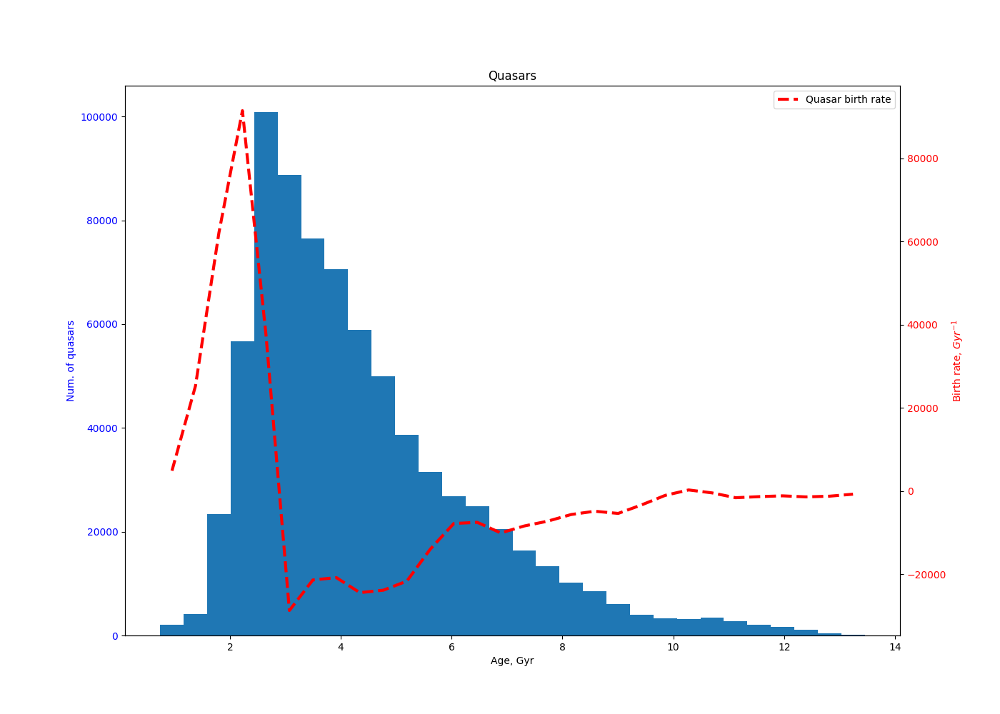

# LifetimeOfQuasars
Estimating the Quasar Formation Rate Using Sloan Digital Sky Survey (SDSS) Data

## Key Ideas

1. **Quasar Lifetime**:
   - The accepted lifetime of quasars is approximately **55 million years**.
   - Few papers discuss quasar lifetime estimation. One notable reference is [Quasar Clustering and the Lifetime of Quasars](https://arxiv.org/pdf/astro-ph/0002384).
   - You can adjust this value in the code to explore its impact.

2. **Data Collection**:
   - Quasar redshifts (z) are queried from the [SkyServer](https://skyserver.sdss.org/).
   - Due to a server limit of 500,000 rows per query, the Universe's lifetime is divided into subranges, and queries are run for each subrange sequentialy.
   - The results are merged into a single dataset. A full list of approximately 750,000 quasars is available as [quasars.json](quasars.json).
   - The code uses this file if it exists. To regenerate it, delete the local copy and re-run the code.

3. **Quasar Birth Rate Estimation**:
   - The quasar birth rate is calculated approximately.
   - Negative values in the results are likely due to noise in the data.

## The code

Python code is available as [quasar_ages.py](quasar_ages.py)

Requirements to be installed is available [here](requirements.txt).

## Results

- **Age of the Universe**: Measured in billions of years (Gyr).
- **Birth Rate**: Measured in quasars per billion years (Gyr-1).

The quasar birth rate peaks around **2 billion years after the Big Bang** and then declines sharply.
